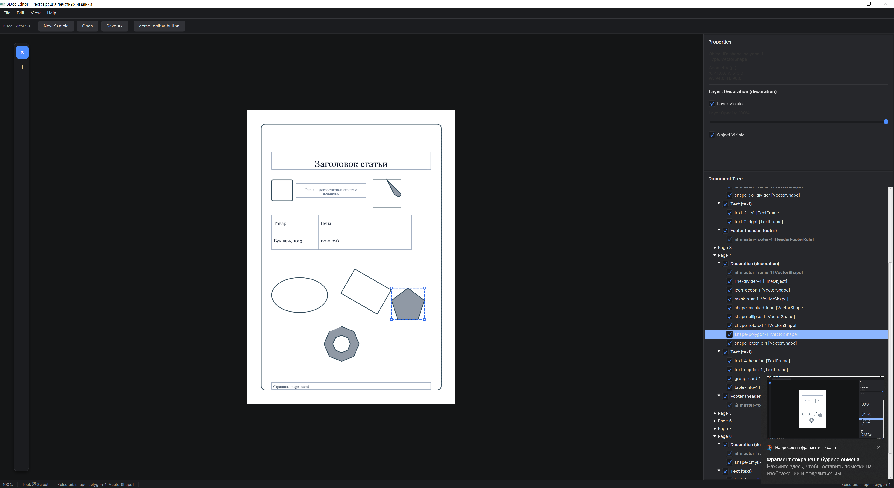
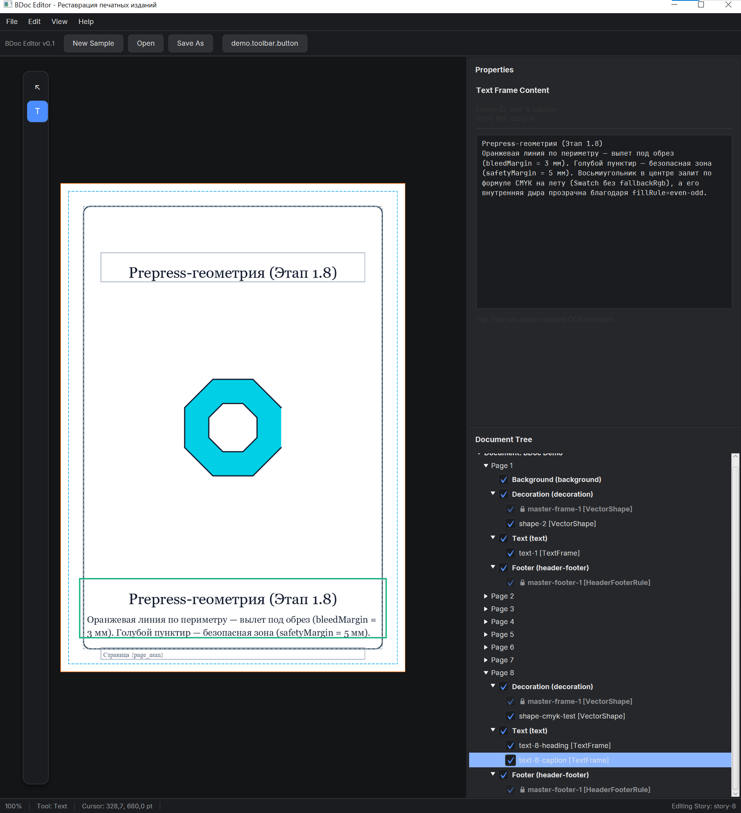
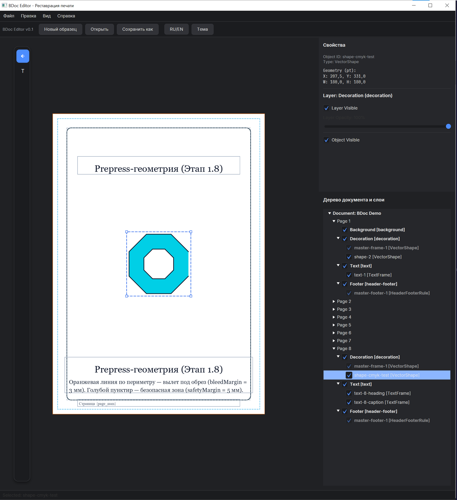
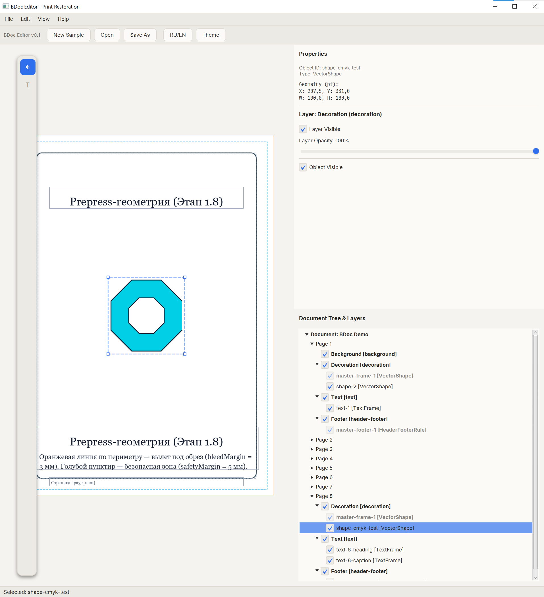

# BDoc Editor 📚✨

`BDoc Editor` — это расширяемая издательская система (DTP) с открытым исходным кодом и визуальный редактор макетов, созданный специально для реставрации книг, реконструкции верстки и профессионального цифрового набора текстов.

В рамках проекта разрабатывается открытая спецификация формата **BDoc (Book Document)** — чистая и современная альтернатива устаревшим закрытым бинарным форматам (таким как IDML, INDD или Scribus SLA). Архитектура системы изначально проектируется под высокоточную предпечатную подготовку (Prepress), многослойный рендеринг холста и восстановление геометрии страниц с помощью ИИ.



---

## 🚀 Ключевые особенности и архитектура

* **Строгое разделение Model/UI:** Ядро модели данных (`bdoc-model`) состоит из чистых POJO-классов, полностью отвязанных от графических фреймворков (JavaFX/Canvas). Это позволяет валидировать документы в консольном режиме (headless), обрабатывать файлы через CLI и писать независимые плагины автоматизации.
* **Расширяемая плагинная архитектура SPI:** По аналогии с IntelliJ Platform, интерфейс программы динамически регистрирует новые инструменты, панели и фильтры на основе декларативных конфигурационных файлов плагинов.
* **Профессиональные DTP-возможности (В разработке):** Жесткая система единиц измерения (пункты, миллиметры, пайки), многопроходный алгоритм верстки абзацев (Paragraph Composer по Кнуту-Плассу), сквозные цепочки текстовых фреймов (Story threading) и поддержка цветовых профилей CMYK/ICC.
* **Инструменты для реставрации книг:** Специализированные структуры данных для хранения «грязных» сканов-подложек, скрытых слоев распознанного ИИ-текста (AI-OCR) и реставрационных метаданных без нарушения валидности основного контейнера документа.

### 📸 Скриншоты программы

<p align="center">
  
  
  
</p>

---

## 🛠 Структура проекта

Репозиторий разделен на изолированные независимые модули:

* `bdoc-core` — основная бизнес-логика приложения и движок выполнения.
* `bdoc-model` — чистые POJO-модели документа, независимые от интерфейса (сериализуются в JSON/CBOR).
* `bdoc-ui` — визуальный десктопный редактор, написанный на JavaFX.
* `bdoc-spi` — интерфейсы сервисов (Service Provider Interfaces) и точки расширения для разработчиков плагинов.
* `bdoc-io` — драйверы ввода-вывода для сериализации формата и импорта сторонних документов.
* `bdoc-plugin-demo-toolbar` — пример реализации полностью отвязанного плагина панели инструментов для UI.

---

## 📂 Спецификация открытого формата BDoc (v0.1)

Открытая спецификация расширения `.bdoc` разработана как каноническое представление электронного документа, не зависящее от конкретной среды выполнения или программного рендера. Формат объединяет лучшие практики DTP-моделей (InDesign IDML, Scribus SLA, ODF) и стандартов разметки архивов (ALTO/PAGE OCR).

### Архитектурные принципы
* **Разделение слоев:** Полная изоляция логического смысла текста (`Stories`), геометрии физического размещения (`Pages`) и графических правил отрисовки элементов (`Graphics`).
* **Детерминированность макета:** Декларативная структура данных гарантирует воспроизводимость верстки; исполнение произвольных скриптов общего назначения внутри файла полностью запрещено.
* **Доступность данных:** Встроенное индексирование логического порядка чтения для корректного экспорта в reflowable-форматы (EPUB, HTML) и интеграции с системами чтения экрана.

### Модульная структура блоков формата
Минимальный жизнеспособный контейнер спецификации v0.1 декомпозирует данные документа на следующие верхнеуровневые блоки:

| Блок | Назначение и целевая область |
| :--- | :--- |
| **`Document`** | Корневая точка входа, хранящая метаданные, уникальный ID, тип документа и глобальные конфигурации. |
| **`Templates`** | Шаблонные сущности: мастер-страницы (Master Pages), сетки колонок, поля выравнивания и правила колонтитулов. |
| **`Pages`** | Физические поверхности страниц и разворотов (Spread), связывающие геометрию холста со ссылками на объекты. |
| **`Layers`** | Слои визуальной композиции (подложки сканов, векторный декор, текстовый слой, аннотации, направляющие). |
| **`Stories`** | Потоки сплошного текста, существующие независимо от фреймов и перетекающие между ними. |
| **`Styles`** | Реестры переиспользуемых правил оформления текста, абзацев, графических фреймов и таблиц. |
| **`Graphics`** | Описание векторной 2D-геометрии, матриц трансформации, путей отсечения (ClipPath) и масок прозрачности. |
| **`Assets`** | Изолированный реестр внешних бинарных ресурсов (шрифты, растровые изображения, ICC-профили цвета). |
| **`ReadingOrder`** | Индексы явного порядка чтения для многоколоночных страниц, сносок и врезок. |

### Ключевые подсистемы данных
* **Текстовая подсистема (`Stories`):** Текст делится на иерархию `Story` ➔ `Paragraph` ➔ `Span`. Каждому абзацу присваивается строгая семантическая роль (`title`, `heading`, `body`, `caption`, `footnote`).
* **Геометрическое ядро (`Graphics`):** Обеспечивает математически точное описание векторов от базовых примитивов (`Point`, `Rect`, `Ellipse`) до составных контуров произвольной формы (`BezierPath`, `CompoundPath`) с поддержкой матриц смещения, поворота и масштабирования.

---

## 🗺 Дорожная карта и текущий статус

Разработка разбита на последовательные инженерные этапы:

1. **Этап 1: Структура документа и базовая геометрия**
    * [ ] Шаблоны страниц (Master Pages), модели полей и сетки макета.
    * [ ] Контейнеры порядка чтения (ReadingOrder) и контуры обтекания текстом.
    * [ ] Расширенная векторная геометрия (BezierPaths, CompoundPaths) и калькулятор пересчета единиц измерения.
    * [ ] Связывание текстовых фреймов (Story threading) и иерархия стилей объектов.
2. **Этап 2: Издательские функции и модуль Preflight**
    * [ ] Применение и переопределение элементов Master Pages в интерфейсе.
    * [ ] Встроенная проверка Preflight (эффективный DPI сканов, цветовой режим, вылеты под обрез bleed/trim).
    * [ ] Специализированные DTP-инструменты (Gap Tool для зазоров, Scissors/Pen для узлов, Eyedроппер для пипетки стилей).
    * [ ] Продвинутая типографика (выключка по формату Кнута-Пласса, лигатуры OpenType).
3. **Этап 3: Оптимизация рендеринга и SDK**
    * [ ] Растровый кэш страниц (Render Cache) для плавной прокрутки книг на 1000+ страниц на слабом железе.
    * [ ] Полноценный маркетплейс декларативных плагинов.

---

## 🏗 Сборка и запуск

### Требования
* **JDK 17** или выше
* **Gradle** (компонент Gradle Wrapper уже включен в проект)

### Компиляция проекта
Клонируйте репозиторий и соберите проект с помощью Gradle:

```bash
git clone https://github.com
cd bdoc-editor
./gradlew build
```

Для запуска графического интерфейса JavaFX выполните задачу подмодуля `bdoc-ui`:
```bash
./gradlew :bdoc-ui:run
```

---

## 🤝 Участие в разработке

Мы создаем инструмент, который будет одинаково полезен реставраторам архивов, шрифтовикам и инженерам. Если вы хотите внести вклад в развитие спецификации формата, разработку текстового движка или написание импортеров из старых форматов верстки — мы рады любым Pull Requests!

Вы можете открыть новую Issue, предложить улучшения кода или изучить текущий черновик спецификации в файле `preliminary-open-document-spec-v0.1.md`.

## 📄 Лицензия
Этот проект распространяется под лицензией MIT.
